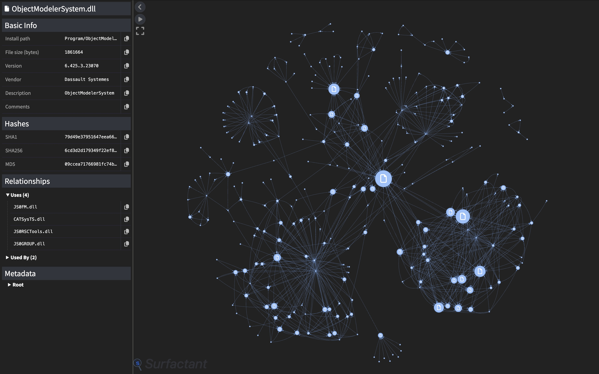

# SBOM Visualization Plugin
A plugin for Surfactant that generates interactive visualizations of CyTRICS-formatted SBOMs


## Installation
1. Create a virtual environment
```bash
$ python -m venv venv && . ./venv/bin/activate
```
2. Install dependencies
```bash
$ pip install .
```

## Usage
The plugin can generate visualizations when running Surfactant's `generate` command or as a standalone script.

### Generating with Surfactant
Passing in `sbom_vis` as the output format will cause Surfactant to generate an HTML file with the same name as the SBOM containing the visualization. The original JSON SBOM will also be saved to the same directory.
```bash
$ surfactant generate --output_format=sbom_vis SPECIMEN_CONFIG SBOM_OUTFILE
```

### Generating standalone
Visualizations can be created from an existing SBOM file by passing in the path with `-p`.
```
usage: visualization.py [-h] -p PATH [PATH ...] [-c [CULL]] [-pb [USE_PROGRESS_BAR]]

Surfactant SBOM Visualization

options:
  -h, --help            show this help message and exit
  -p PATH [PATH ...], --path PATH [PATH ...]
                        Path(s) to JSON SBOMs
  -c [CULL], --cull [CULL]
                        Enable culling of isolated nodes (may improve performance on large graphs at the cost of node completeness)
  -pb [USE_PROGRESS_BAR], --use-progress-bar [USE_PROGRESS_BAR]
                        Display progress bar while waiting for large graphs to load instead of disabling physics
```

## Controls
Several controls are included:
* Clicking on a node will reveal a sidebar with more information about it
* Right clicking on a node will pin/unpin it in place
* Archives and containers can be expanded or collapsed by double clicking

Note: Physics is initially disabled for large graphs (~600+ nodes) to improve loading times. Once the graph is on screen it should be re-enabled via clicking the toggle in the upper left corner.
